  

    
  

  

   

  

    
    
    
    
    
  

  

    
  

  

 

### 🛰️ Engineering Profile & Professional Background

<table border="0" width="100%">
  <tr>
    <td width="65%" valign="top">
      
<b>Rafi Rizqallah Andila</b> is a Fullstack Developer specializing in <b>Frontend Architecture</b> and high-performance enterprise dashboards. Currently focused on engineering mission-critical systems and scalable IT infrastructure platforms at <b>PT Swadharma Utama Prima</b>.

       
      
<b>Current Role:</b> Fullstack Developer at <b>PT Swadharma Utama Prima</b>

      
<b>Prior Experience:</b> Frontend Developer at <b>PT Millenio Amerta Data (AssistX Enterprise)</b>

      
<b>Education:</b> UPN Veteran Jakarta (Associate) • Universitas Terbuka (Bachelor)

      
<b>Certifications:</b> BNSP Junior Web Programmer • freeCodeCamp Legacy Front-End • HackerRank Node.js

      
<b>Interactive Site:</b> <a href="https://www.rafirizqallahandila.xyz/"><b>rafirizqallahandila.xyz</b></a>

    </td>
    <td width="35%" align="center" valign="middle">
      
    </td>
  </tr>
</table>

 

  

 

### ⚡ Core Technologies & Arsenal (Based on Professional Experience)

  <table border="0">
    <tr>
      <td align="center" width="25%">
        <b>⚡ Frontend & UI</b>  
        &nbsp;&nbsp;
        &nbsp;&nbsp;
        &nbsp;&nbsp;
        
      </td>
      <td align="center" width="25%">
        <b>⚙️ Backend & Systems</b>  
        &nbsp;&nbsp;
        &nbsp;&nbsp;
        &nbsp;&nbsp;
        
      </td>
      <td align="center" width="25%">
        <b>🗄️ Database & Cloud</b>  
        &nbsp;&nbsp;
        &nbsp;&nbsp;
        &nbsp;&nbsp;
        
      </td>
      <td align="center" width="25%">
        <b>🛠️ DevOps & UI Kits</b>  
        &nbsp;&nbsp;
        &nbsp;&nbsp;
        &nbsp;&nbsp;
        
      </td>
    </tr>
  </table>

 

  

 

### 📂 Real-World Enterprise Projects (From Verified Track Record)

<table>
  <tr>
    <td width="50%" valign="top">
      <h3>🏢 Smart-Q IT Asset Management</h3>
      
<b>Client/Org:</b> PT Swadharma Utama Prima (Fullstack Developer)

      
Enterprise IT asset lifecycle and tracking system engineered with interactive dashboards, comprehensive inventory reporting, and relational state persistence.

      <ul>
        <li><b>Stack:</b> Next.js • Tailwind CSS • Supabase (PostgreSQL)</li>
        <li><b>Key Impact:</b> Automated asset reconciliation and streamlined operational visibility.</li>
      </ul>
    </td>
    <td width="50%" valign="top">
      <h3>📊 Centralized Monitoring Dashboard</h3>
      
<b>Client/Org:</b> AssistX Enterprise (Frontend Developer)

      
Mission-critical real-time telemetry and monitoring suite developed for high-volume enterprise operations (including PSSI & BSI Sentrakas dashboards).

      <ul>
        <li><b>Stack:</b> Next.js • React.js • Material UI • Chart.js • Go REST APIs</li>
        <li><b>Key Impact:</b> Sub-second metrics refresh, internationalization (i18n), dynamic filtering.</li>
      </ul>
    </td>
  </tr>
  <tr>
    <td width="50%" valign="top">
      <h3>👥 MAGENTA (Magang Bertalenta BUMN)</h3>
      
<b>Client/Org:</b> AssistX Enterprise (Frontend Developer Bilingual)

      
National talent management & internship recruitment engine connecting participants with state-owned enterprise workflows.

      <ul>
        <li><b>Stack:</b> Laravel • PostgreSQL • RESTful APIs</li>
        <li><b>Key Impact:</b> End-to-end applicant lifecycle, verification pipelines, and database optimization.</li>
      </ul>
    </td>
    <td width="50%" valign="top">
      <h3>🚔 POLRI Vehicle Accident Data System</h3>
      
<b>Client/Org:</b> PT Jasa Raharja (Fullstack Developer)

      
Government-facing vehicle incident & claims data management platform driving inter-agency digital transformation.

      <ul>
        <li><b>Stack:</b> Laravel • MySQL • REST APIs</li>
        <li><b>Key Impact:</b> Secure data ingestion, workflow validation, and rapid claims reporting.</li>
      </ul>
    </td>
  </tr>
</table>

 

  

 

### 📈 Verified Activity & Productivity Metrics

  

 

  

 

  

 

  

